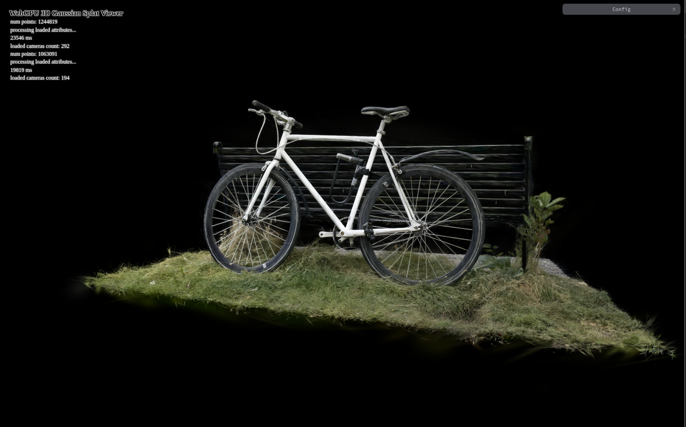
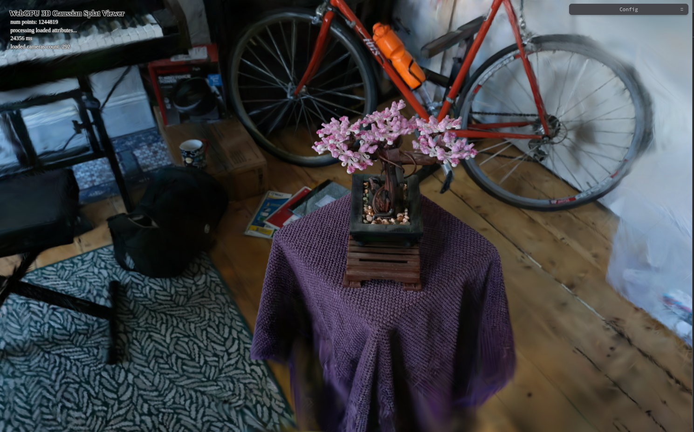
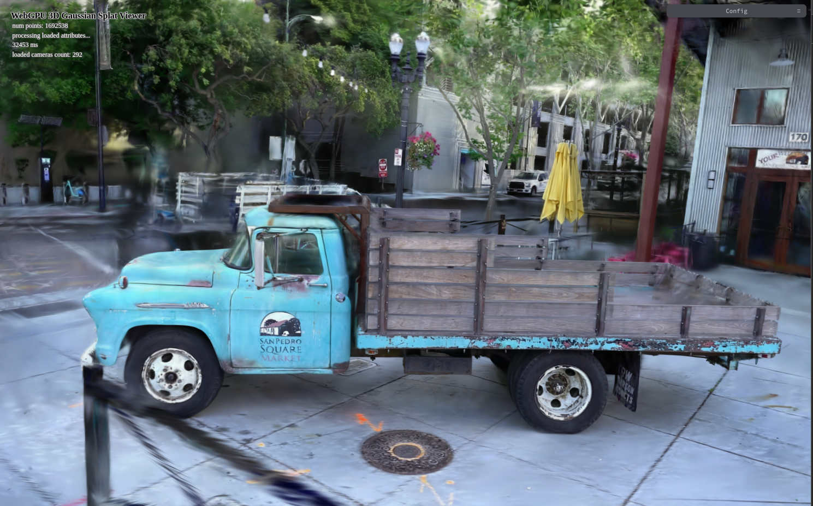
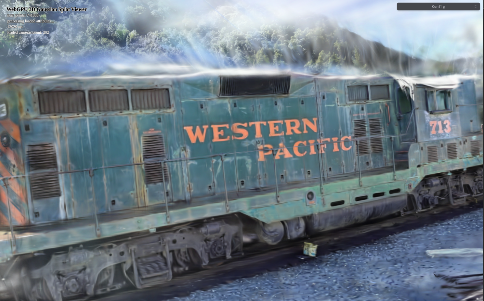
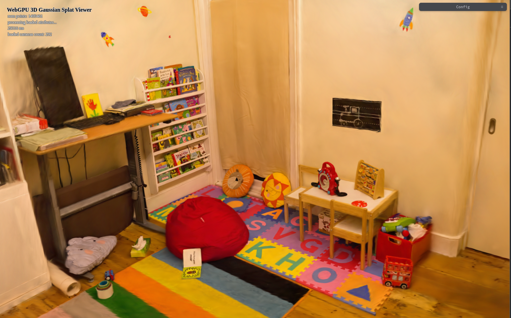
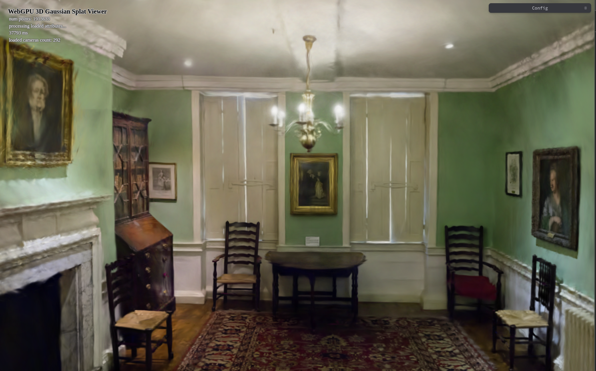
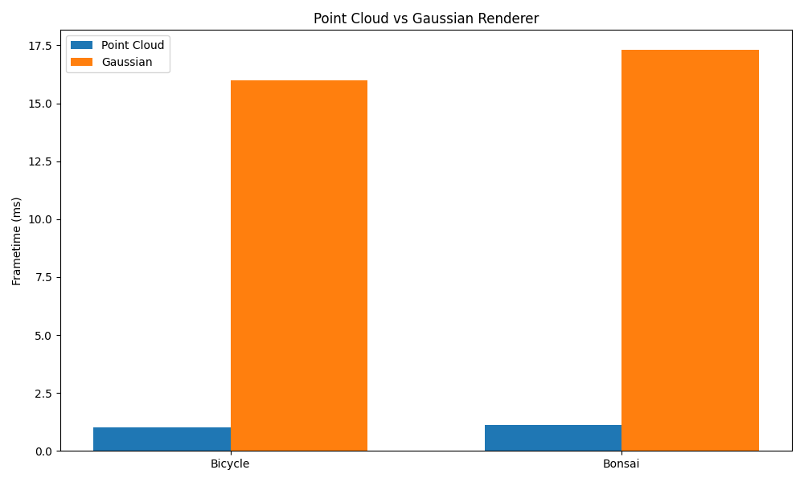
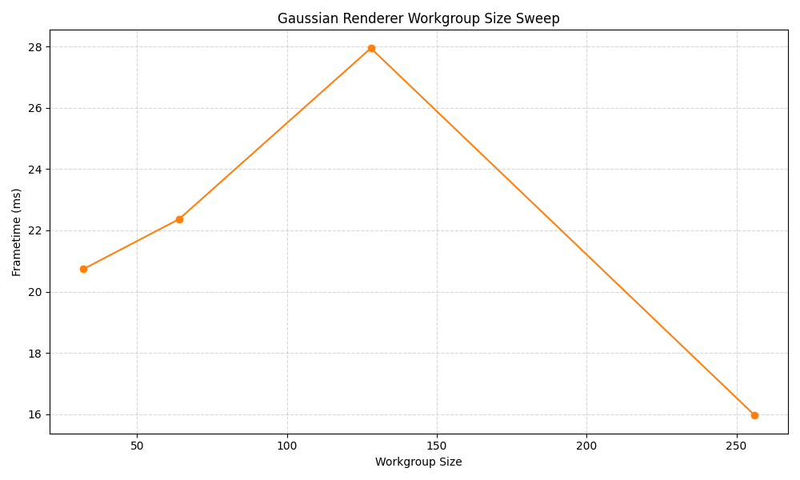
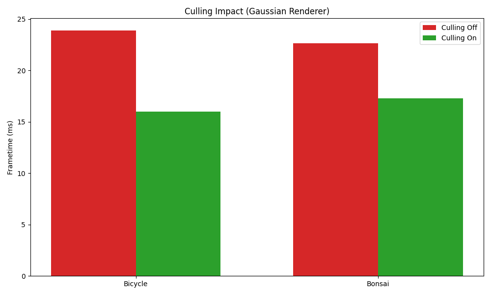
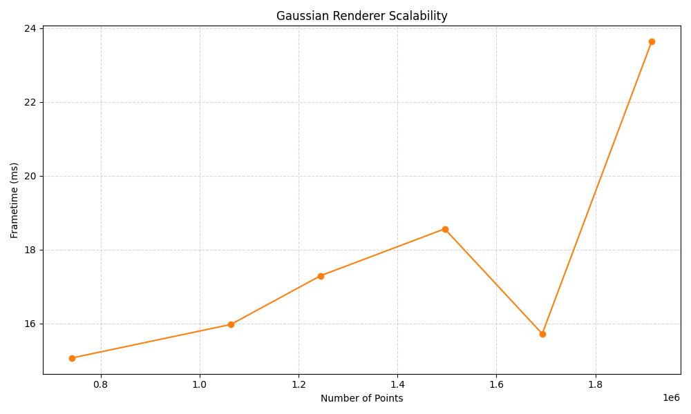

**University of Pennsylvania, CIS 5650: GPU Programming and Architecture, Project 5**

* Yannick Gachnang
  * [LinkedIn](https://www.linkedin.com/in/yannickga/)
* Tested on: Windows 10, EPYC 9354 @ 3.25GHz, 16GB RAM, RTX 2000 Ada 23GB VRAM

Project 5 WebGPU Gaussian Splat Viewer
====================

**Live Demo can be found [here](https://krispy-kenay.github.io/Project5-WebGPU-Gaussian-Splat-Viewer/)**

## Demo
<video src="https://github.com/user-attachments/assets/6cd6f02a-db33-4faa-8520-f3e332b3c67b" controls width="100%"></video>
 
*Demo Showcase*

 
*Reduced Scale Bicycle scene from the provided `.ply` files*

 
*Bonsai scene from the provided `.ply` files*

 
*Reduced Scale Truck scene from the Voxel 51 dataset*

 
*Reduced Scale Train scene from the Voxel 51 dataset*

 
*Reduced Scale Playroom scene from the Voxel 51 dataset*

 
*Reduced Scale Dr. Johnson scene from the Voxel 51 dataset*

## Implementation

### Point cloud renderer

The point cloud pass exists mainly to check that the camera and buffer setup work and to give a visual starting point. 
Each point is transformed by the usual model view projection chain
$p_{\text{clip}} = P \, V \, M \, [x\ y\ z\ 1]^T$.
Positions are divided by ($w$) to reach NDC and then written to the color target with a fixed yellow.

### Gaussian renderer

The Gaussian path is based on the main ideas from the 3D Gaussian Splatting paper but uses a simpler 2D reconstruction in the raster stage.
The pipeline loads attributes per point which include center position, rotation, log scale, opacity and spherical harmonics coefficients.
The compute step processes these into compact screen space splat data.
The sort step then reorders visible splats by depth for blended composition.
And finally the render pass rebuilds a small quad for each splat and runs a conic test in the fragment shader to get a smooth alpha falloff.
The simplification is that the quad is rebuilt in screen space with a radius coming from the projected covariance which keeps things short while keeping the right look.

#### Preprocessing compute

For every Gaussian with index ($i$) the center is transformed to view and clip space using the same matrices as the point cloud.
A conservative culling test runs in NDC with a small margin so boundary splats survive.
The stored scale is in log space and converted with $s = \exp(\ell)$ and the per axis scale multiplier from the GUI is added here.
The rotation matrix ($R$) is built from the provided orientation and the 3D covariance of the ellipsoid in object space is lifted to camera space with:

$$\Sigma_{3D} = R \, \text{diag}(s_x^2, s_y^2, s_z^2) \, R^T$$

Like in the paper the screen space covariance comes from the local projection Jacobian ($J$) evaluated at the splat center.
With a standard pinhole camera this is the linear mapping that turns a small 3D offset near the center into NDC.
The 2D covariance is:

$$\Sigma_{2D} = J \, \Sigma_{3D} \, J^T$$

From $\Sigma_{2D}$ we get the conic matrix for the centered quadratic form $A = \Sigma_{2D}^{-1}$.
The maximum extent is taken from the eigenvalues of $\Sigma_{2D}$.
That extent is turned into a half size in NDC for the quad build and also kept in pixel units for the fragment test.
In this project a simpler 2D projection is used which treats the local perspective terms as constant over the quad.
This matches what most implementations do and looks almost the same as the full version for small quads.
I did experiment with a full 3D projection at first but it turned out to be pretty inconsistent visually and fiddly to get stable.
In most cases the 2D approximation produced a better result with lower implementation complexity so it became a no-brainer.

The color is calculated from the spherical harmonics coefficients.
The view direction in world or camera space is evaluated by the helper and then converted to RGB.
Opacity uses the logistic recovery from the paper, if ($o$) is the stored opacity parameter then:

$$\alpha_{\max} = \frac{1}{1 + \exp(-o)}$$

Both color and $\alpha_{\max}$ are packed to f16 pairs for bandwidth. 
Visible splats write their packed 2D data to a Splat buffer and also add their depth and index to the sort buffers.
The visible count uses `atomicAdd` and that count updates the indirect instance count for rendering later.
Depth sorting is then performed using the given radix sort.
The sort key is the camera space ($z$) so composition goes from far to near.
Only indices are moved which keeps the Splat buffer in place and avoids large copies.

#### Vertex and fragment stages

The vertex shader builds a screen space quad per instance.
The instance id looks up the sorted index then reads the matching Splat entry.
The four corners are placed around the NDC center using the precomputed half size.
Per vertex data includes the center in pixels, the conic matrix ($A$) in a compact two by two form and the color with $\alpha_{\max}$.
No world space work is needed here since the quad lives directly in screen space.
The fragment shader checks if a pixel is inside the Gaussian footprint and computes alpha falloff using:

$$t = d^T A \, d$$

The opacity at that pixel is:

$$\alpha = \alpha_{\max} \, \exp\left(-\tfrac{1}{2} t\right)$$

Fragments with large ($t$) give a very small alpha and can be skipped by a threshold for speed.
Blending uses standard source alpha over with depth writes off and depth testing on.
The draw call is indirect so the instance count matches the number of visible splats found by the compute pass.

## Performance Analysis

| Scene       | Number of Points |
| :---------- | ---------------: |
| Train       |          741,883 |
| Bicycle     |        1,063,091 |
| Bonsai      |        1,244,819 |
| Playroom    |        1,495,461 |
| Truck       |        1,692,538 |
| Dr. Johnson |        1,913,633 |

All tests were done in Chrome with WebGPU on.
Each setup was averaged over five runs with 300 frames each.
The camera was placed to show as much of the scene as possible.
Because of how WebGPU sends out workgroups and sorts data on the GPU, performance varied from run to run so results are shown as averages.

### Comparison Between Point Cloud and Gaussian Renderer

The point cloud renderer ran much faster than the Gaussian one but gave a rougher and noisier image.
For the bicycle scene the point cloud ran around 1.02 ms/frame while the Gaussian one was around 16.0 ms/frame.
Similarly, the numbers for the bonsai scene were 1.11 ms/frame and 17.3 ms/frame respectively.
The slower speed is expected since the Gaussian renderer does per splat blending, transparency sorting and fragment opacity work.

The graph below shows how large this gap is and how much cost the Gaussian path adds but it also shows why the image looks smooth and continuous compared to the barebones point cloud.

### Workgroup Size Sweep

Workgroup size clearly affected performance.
The graph below shows that 256 gave the best frametime at about 16.0 ms/frame while 128 was the most stable at around 27.9 ms/frame.
At workgroup size 32, frametime went up to about 20.7 ms/frame and also jumped more from frame to frame.
These changes are small in absolute numbers but stayed consistent across runs.
The takeaway here is that 256 threads per workgroup offered the best performance for this project, even though frame stability was slightly better around 128.

### Effect of View Frustum Culling

The graph below shows that turning on culling improved performance a lot for both tested scenes.
With culling off the bicycle scene averaged about 23.9 ms/frame while turning it on lowered it to 16.0 ms/frame.
For the bonsai scene the numbers went from 22.7 ms/frame to 17.3 ms/frame.
The change is clear and steady over runs even with some frame variation.
Culling removes off-screen Gaussians from the preprocessing and rendering stages, reducing both sorting overhead and fragment overdraw.
View-frustum culling provides a real performance benefit, especially in scenes where a large portion of the geometry is outside the camera view.

### Performance Scaling With Number of Points

Finally the effect of more Gaussians was tested by rendering several models from about 740k to 1.9 million points.
The graph below shows that as point counts went up frametime rose almost linearly which makes sense since both preprocessing and sorting run per Gaussian.
The train scene (741,883 points) ran around 15.1 ms/frame while the dr. johnson scene (1,913,633 points) was about 23.6 ms/frame.
The curve is not perfectly smooth because of frame-to-frame variation and differences in camera coverage, but the general upward trend is clear.
This shows that performance scales roughly linearly with the number of Gaussians, confirming that the renderer is primarily limited by per-splat computation and fill rate rather than fixed overhead.

## Conclusion

The renderer does real time Gaussian splatting fully in WebGPU and gives stable smooth results that match the look from the paper.
The simplified 2D projection keeps the code efficient without lowering visual quality in a visible way.
Performance behaves as expected, going up with culling and scaling predictably with scene size.
Overall the project shows that modern browser GPUs can handle advanced rendering methods.

## Credits

- [Vite](https://vitejs.dev/)
- [tweakpane](https://tweakpane.github.io/docs//v3/monitor-bindings/)
- [stats.js](https://github.com/mrdoob/stats.js)
- [wgpu-matrix](https://github.com/greggman/wgpu-matrix)
- Special Thanks to: Shrek Shao (Google WebGPU team) & [Differential Guassian Renderer](https://github.com/graphdeco-inria/diff-gaussian-rasterization)
- [Voxel 51 dataset](https://huggingface.co/datasets/Voxel51/gaussian_splatting)
